Digital LED lamp controlled using infrared remote
=================================

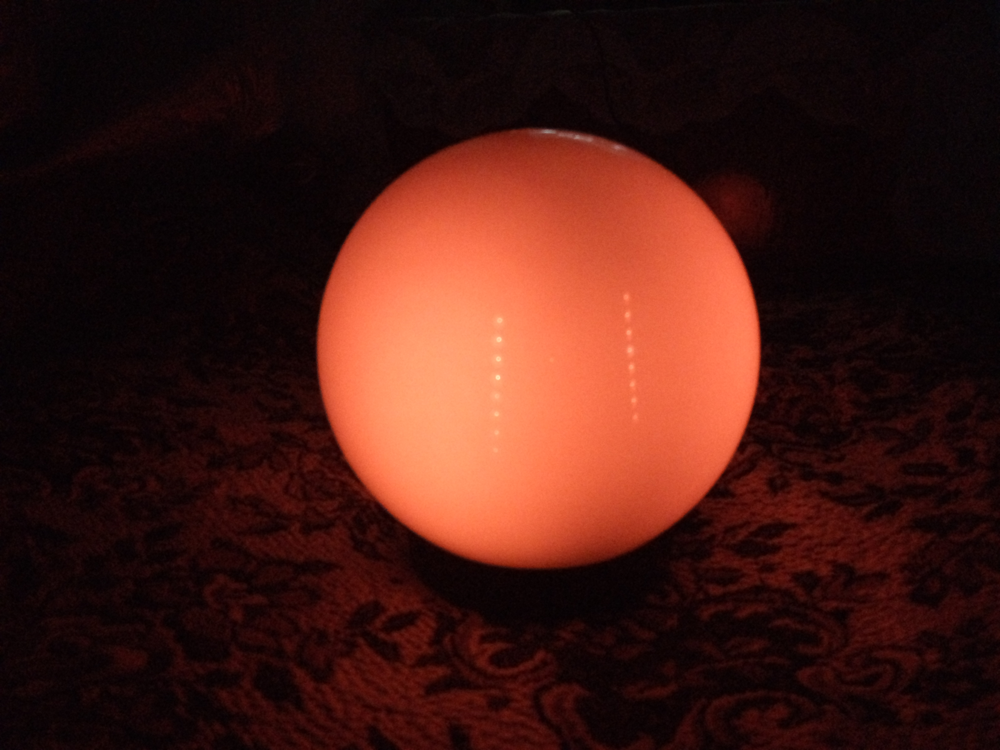

Required Components:
---------------------------------

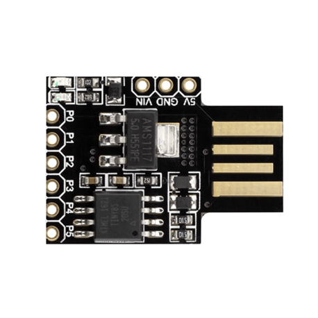

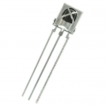

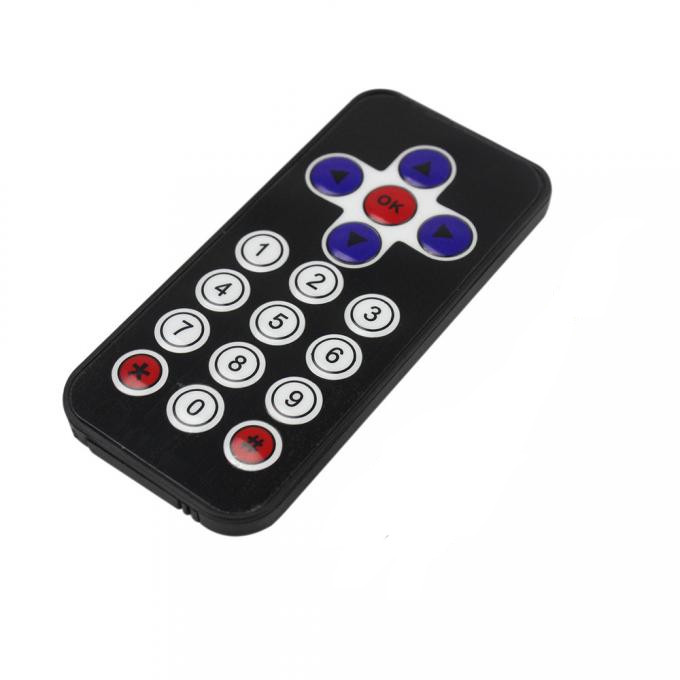

- Digispark ATtiny85
- 38kHz IR receiver  VS1838B (or TSOP4838)
- Remote control
- WS2812B LED strip or circle
- Resistor 220 Om
- 5V power supply (powerful)

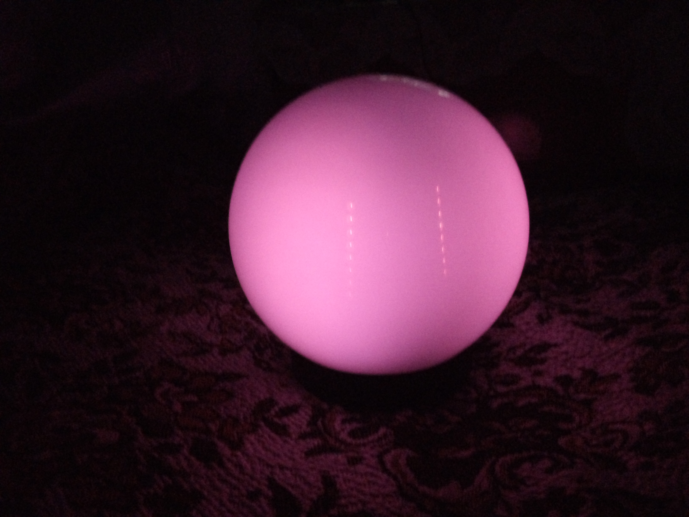

Circuit:
--------------------

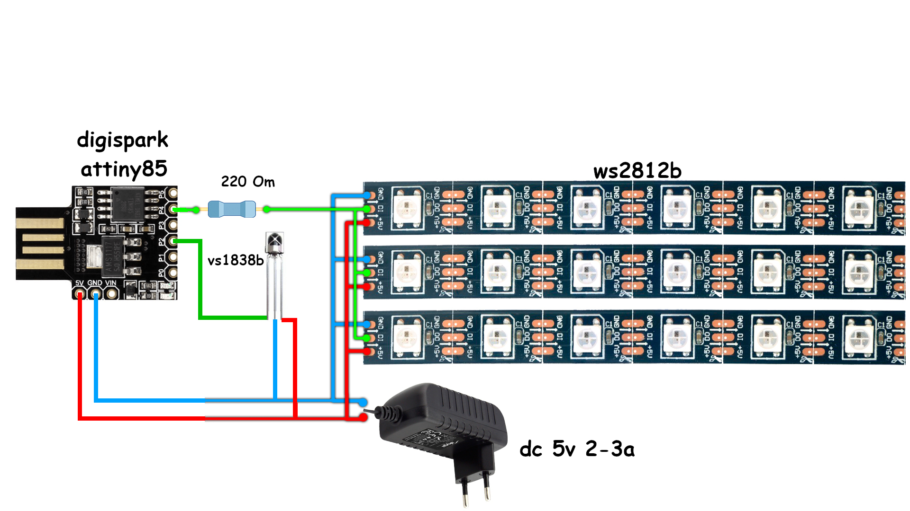

 * ws2812 strip Signal pin to digispark attiny85 Pin 4
 * ir receiver Signal pin to digispark attiny85 Pin 2

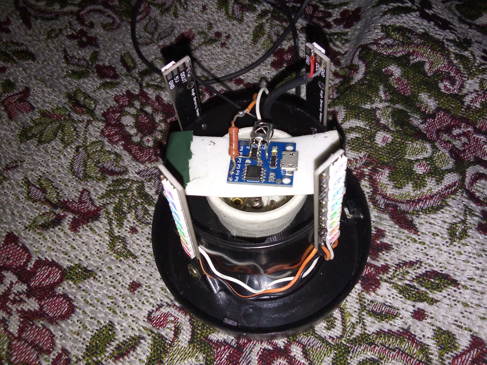

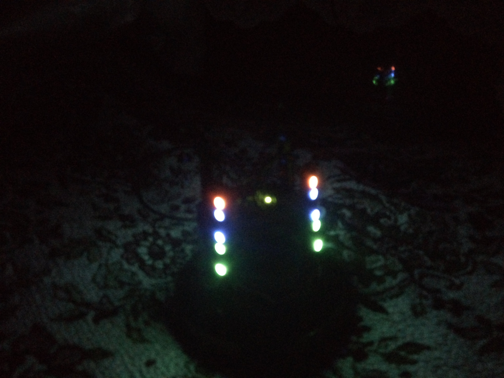

Settings in Sketch:
--------------------

You need to change the file digispark85_ir_lamp.ino according to your remote control and number of LEDs.
You need to define remote control keys in part "Settings".
You can to get the keycodes of the remote here: https://www.instructables.com/id/DIY-USB-IR-receiver/ .
In part "Settings" define the number of LEDs in one piece of strip (#define NUM_LEDS 8).

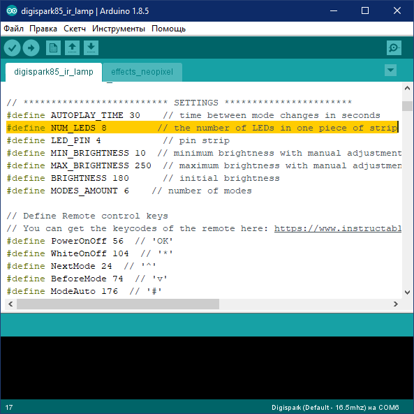

Also you can to change time between effects mode (#define AUTOPLAY_TIME 30).

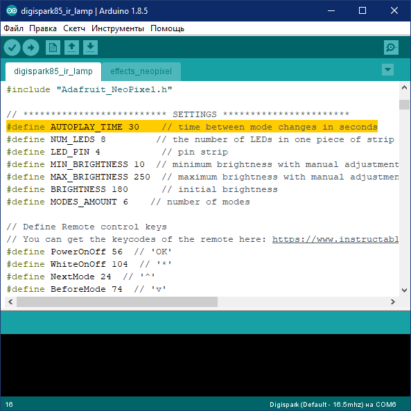

Usage:
--------------------

Turn On power supply , wait ~5sec and enjoy your lamp with remote control.
Remote control keys: 
 * 'OK' power On/Off
 * '^' 'v' change effects (in white mode change color)
 * '<' '>' change brightness
 * '*' On/Off white mode (accompanied by blue)
 * '#' On/Off mode auto change effects (accompanied by red if On and green if Off) 

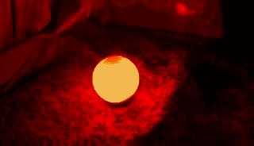

License
-----------------
GNU GPL 3
